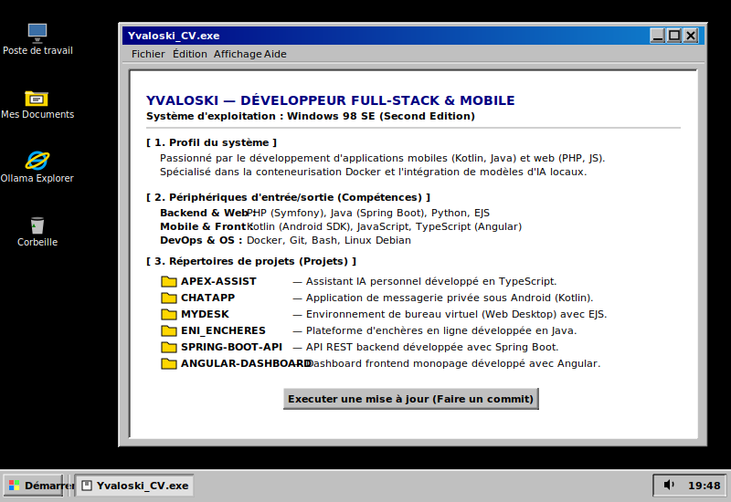

# 💻 Yvaloski's Retro Workstation

<!-- Rendu de l'image Windows 98 -->

  

---

### 📂 Explorateur de fichiers (Raccourcis cliquables)

<table>
  <tr>
    <td width="50%">
      <strong>📁 Mes Documents (Projets)</strong>
      <ul>
        <li>⚡ <a href="https://github.com/Yvaloski/apex-assist">apex-assist</a> — Assistant IA personnel (TS)</li>
        <li>💬 <a href="https://github.com/Yvaloski/ChatApp">ChatApp</a> — Chat mobile privé (Kotlin)</li>
        <li>🖥️ <a href="https://github.com/Yvaloski/mydesk">mydesk</a> — Bureau virtuel web (EJS)</li>
        <li>🛍️ <a href="https://github.com/Yvaloski/Eni_Encheres">Eni_Encheres</a> — Plateforme d'enchères (Java)</li>
        <li>☕ <a href="#">spring-boot-api</a> — API REST Backend (Spring Boot)</li>
        <li>🅰️ <a href="#">angular-dashboard</a> — Dashboard Frontend SPA (Angular)</li>
      </ul>
    </td>
    <td width="50%">
      <strong>⚙️ Panneau de configuration (Compétences)</strong>
      <ul>
        <li><strong>Langages :</strong> Kotlin, Java, PHP, TypeScript/JS, Python</li>
        <li><strong>Frameworks :</strong> Spring Boot, Angular, Symfony, Android SDK</li>
        <li><strong>DevOps :</strong> Docker, Git, Bash, Linux Debian</li>
      </ul>
    </td>
  </tr>
</table>

---

### ✉️ Me contacter

*   **LinkedIn** : [Mon Profil](https://linkedin.com/in/votre-nom) *(À personnaliser)*
*   **Email** : [votre.email@example.com](mailto:votre.email@example.com) *(À personnaliser)*

  <em>Dernière mise à jour du système : Juillet 2026 💾</em>

